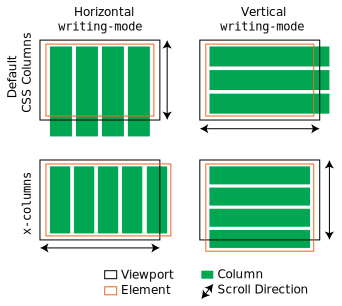

`x-columns`
============================================================

x-columns attempts to add an alternative overflow/layout mode for column based design.

Where the content overflows the element, instead of forcing the user to scroll up and down the page on column break, add more columns.



## Getting Started
1. Either install the package from npm by running:
    ```sh
    $ npm install --save x-columns
    ```
    or [download a release](https://github.com/AshleyWright/x-columns/releases).
2. Then load the package whenever it is required, through:
    ```js
    import "x-columns";
    ```
    or linking the apropriate bundle for your use (from the `dist/` directory):
    ```html
    <script src="{pathToPackage}/dist/x-columns.umd.js" defer></script>
    ```

## Usage
Set the styles of the elements you want `x-columns` to handle to:
```css
.column-layout {
  --x-columns:  auto;
  height:       {anything except auto};
  column-width: {anything except auto};
}
```
or for a vertical writing mode:
```css
.column-layout {
  --x-columns:  auto;
  width:        {anything except auto};
  column-width: {anything except auto};
  writing-mode: {any vertical writing mode};
}
```
plus any other styles of your choosing.

For dynamic addition of elements, ensure the elements are styled as above, and either inform `x-columns` of the particular element:
```js
import { xColumns } from 'x-columns';
xColumns(element);
```
or for multiple elements, trigger a rescan of the document:
```js
import { xColumnsAll } from 'x-columns';
xColumnsAll();
```

MIT &copy; Ashley Wright